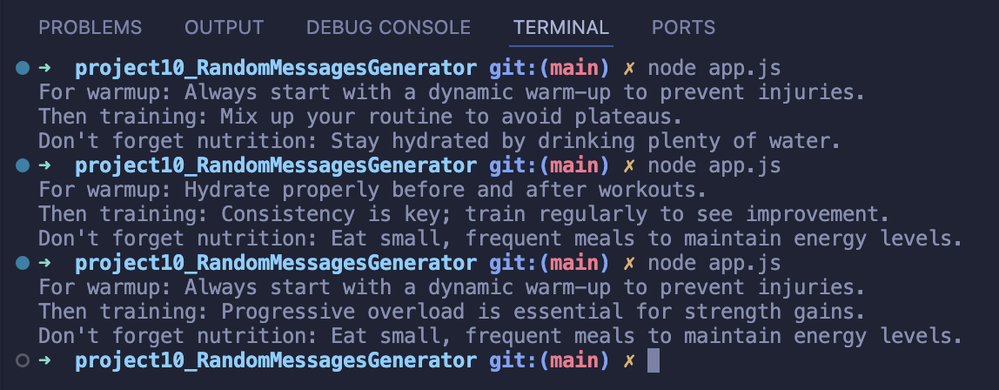

<a id="readme-top"></a>

[![Contributors][contributors-shield]][contributors-url]
[![Forks][forks-shield]][forks-url]
[![Stargazers][stars-shield]][stars-url]
[![Issues][issues-shield]][issues-url]


<!-- PROJECT LOGO -->
<br />
<div align="center">
<h1 align="center"><a href="https://github.com/antancelin/RandomMessagesGenerator_Codecademy">Random Messages Generator</a></h1>

  <p align="center">
    Create a program that generates a random message each time it’s called about sports' tips.
    <br />
    <a href="https://github.com/antancelin/RandomMessagesGenerator_Codecademy"><strong>Explore the docs »</strong></a>
    <br />
    <a href="https://github.com/antancelin/RandomMessagesGenerator_Codecademy/issues/new?labels=bug&template=bug-report---.md">Report Bug</a>
    ·
    <a href="https://github.com/antancelin/RandomMessagesGenerator_Codecademy/issues/new?labels=enhancement&template=feature-request---.md">Request Feature</a>
  </p>
</div>


<!-- TABLE OF CONTENTS -->
<details>
  <summary>Table of Contents</summary>
  <ol>
    <li><a href="#about-the-project">About The Project</a></li>
    <li><a href="#built-with">Built With</a></li>
    <li><a href="#installation">Installation</a></li>
    <li><a href="#Resources">Resources</a></li>
    <li><a href="#contributors">Contributors</a></li>
    <li><a href="#contact">Contact</a></li>
  </ol>
</details>


<!-- ABOUT THE PROJECT -->
## About The Project



<br>

Build a message generator program. Every time a user runs a program, they should get a new, randomized output.

### Project Objectives:
* Build a message generator program using JavaScript
* Use Git version control
* Use command line
* Develop locally on your computer

<p align="right">(<a href="#readme-top">back to top</a>)</p>


<!-- BUILT WITH -->
## Built With

* [![JavaScript]][JavaScript-url]

<p align="right">(<a href="#readme-top">back to top</a>)</p>


<!-- INSTALLATION -->
## Installation

1. Clone the repo
   ```sh
   git clone https://github.com/antancelin/RandomMessagesGenerator_Codecademy.git
   ```
2. Check if node is installed
   ```sh
   node -v
   ```
3. If it's not, install it

4. Go to the project folder and run the program
   ```sh
   node app.js
   ```

<p align="right">(<a href="#readme-top">back to top</a>)</p>


<!-- RESOURCES -->
## Resources

* [Codecademy](https://www.codecademy.com/)
* [W3Schools](https://www.w3schools.com/)
* [MDN Web Docs](https://developer.mozilla.org/en-US/)

<p align="right">(<a href="#readme-top">back to top</a>)</p>


<!-- CONTRIBUTORS -->
## Contributors:

* <a href="https://github.com/antancelin/">
  <p>Antoine ANCELIN</p>
</a>


<p align="right">(<a href="#readme-top">back to top</a>)</p>


<!-- CONTACT -->
## Contact

Antoine ANCELIN - ancelin.ant@gmail.com - [linktr.ee/antancelin](https://www.linktr.ee/antancelin)
<br>
<br>
[![twitter-shield]][twitter-url] 
<br>
[![github-shield]][github-url]
<br>
[![linkedin-shield]][linkedin-url]


Project Link: [https://github.com/antancelin/RandomMessagesGenerator_Codecademy](https://github.com/antancelin/RandomMessagesGenerator_Codecademy)

<p align="right">(<a href="#readme-top">back to top</a>)</p>


<!-- MARKDOWN LINKS & IMAGES -->
<!-- https://www.markdownguide.org/basic-syntax/#reference-style-links -->
[contributors-shield]: https://img.shields.io/github/contributors/antancelin/RandomMessagesGenerator_Codecademy.svg?style=for-the-badge
[contributors-url]: https://github.com/antancelin/RandomMessagesGenerator_Codecademy/graphs/contributors
[forks-shield]: https://img.shields.io/github/forks/antancelin/RandomMessagesGenerator_Codecademy.svg?style=for-the-badge
[forks-url]: https://github.com/antancelin/RandomMessagesGenerator_Codecademy/network/members
[stars-shield]: https://img.shields.io/github/stars/antancelin/RandomMessagesGenerator_Codecademy.svg?style=for-the-badge
[stars-url]: https://github.com/antancelin/RandomMessagesGenerator_Codecademy/stargazers
[issues-shield]: https://img.shields.io/github/issues/antancelin/RandomMessagesGenerator_Codecademy.svg?style=for-the-badge
[issues-url]: https://github.com/antancelin/RandomMessagesGenerator_Codecademy/issues
[license-shield]: https://img.shields.io/github/license/antancelin/RandomMessagesGenerator_Codecademy.svg?style=for-the-badge
[license-url]: https://github.com/antancelin/RandomMessagesGenerator_Codecademy/blob/master/LICENSE.txt
[linkedin-shield]: https://img.shields.io/badge/LinkedIn-0077B5?style=for-the-badge&logo=linkedin&logoColor=white
[linkedin-url]: https://linkedin.com/in/antancelin
[twitter-shield]: https://img.shields.io/badge/Twitter-1DA1F2?style=for-the-badge&logo=twitter&logoColor=white
[twitter-url]: https://twitter.com/antancelin
[github-shield]: https://img.shields.io/badge/GitHub-100000?style=for-the-badge&logo=github&logoColor=white
[github-url]: https://github.com/antancelin
[Next.js]: https://img.shields.io/badge/next.js-000000?style=for-the-badge&logo=nextdotjs&logoColor=white
[Next-url]: https://nextjs.org/
[React.js]: https://img.shields.io/badge/React-20232A?style=for-the-badge&logo=react&logoColor=61DAFB
[React-url]: https://reactjs.org/
[Vue.js]: https://img.shields.io/badge/Vue.js-35495E?style=for-the-badge&logo=vuedotjs&logoColor=4FC08D
[Vue-url]: https://vuejs.org/
[Angular.io]: https://img.shields.io/badge/Angular-DD0031?style=for-the-badge&logo=angular&logoColor=white
[Angular-url]: https://angular.io/
[Svelte.dev]: https://img.shields.io/badge/Svelte-4A4A55?style=for-the-badge&logo=svelte&logoColor=FF3E00
[Svelte-url]: https://svelte.dev/
[Laravel.com]: https://img.shields.io/badge/Laravel-FF2D20?style=for-the-badge&logo=laravel&logoColor=white
[Laravel-url]: https://laravel.com
[Bootstrap.com]: https://img.shields.io/badge/Bootstrap-563D7C?style=for-the-badge&logo=bootstrap&logoColor=white
[Bootstrap-url]: https://getbootstrap.com
[JQuery.com]: https://img.shields.io/badge/jQuery-0769AD?style=for-the-badge&logo=jquery&logoColor=white
[JQuery-url]: https://jquery.com
[HTML5]: https://img.shields.io/badge/HTML5-E34F26?style=for-the-badge&logo=html5&logoColor=white
[HTML5-url]: https://developer.mozilla.org/en-US/docs/Web/Guide/HTML/HTML5
[CSS3]: https://img.shields.io/badge/CSS3-1572B6?style=for-the-badge&logo=css3&logoColor=white
[CSS3-url]: https://developer.mozilla.org/en-US/docs/Web/CSS
[JavaScript]: https://img.shields.io/badge/JavaScript-F7DF1E?style=for-the-badge&logo=javascript&logoColor=black
[JavaScript-url]: https://developer.mozilla.org/en-US/docs/Web/JavaScript
